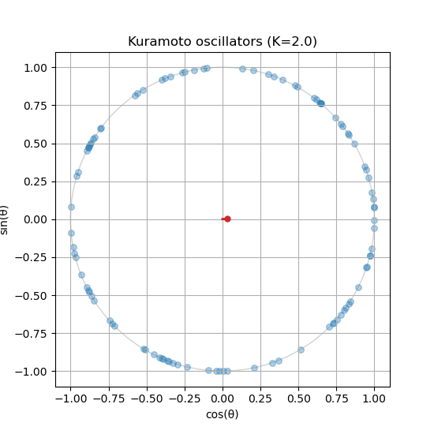

## Animate the Phases

A final snapshot hides how the cluster forms. You can use `matplotlib.animation` to create an animation of the oscillators moving around the unit circle as they evolve according to the Kuramoto ODE. This will allow you to visualize the process of synchronization in real time.

To create an animation, make sure you are working on a Python script in your local computer (e.g., `kuramoto.py`) and run it with `python kuramoto.py`. It is _possible_ to do animations on Jupyter notebooks, but it is more complicated and may not work in all environments.

First, your script should initialize the oscillators and all parameters that you want to control (e.g., coupling strength, number of oscillators, etc.).

```python
# Remember to include / import the following functions
# that you have created earlier:
# initialize_oscillators()
# kuramoto_ode()

coupling_strength = 1.0  # K
num_oscillators = 100  # Number of oscillators
sigma = 1.0  # Standard deviation of the natural frequencies
dt = 0.1  # Time step for the integration time

# Initialize oscillators (phase and natural frequency)
theta, omega = initialize_oscillators(
    num_oscillators,
    sigma=sigma,
    seed=1,
)
t_span = (0, dt)
# For the animation, we use a small time span
# But you can go higher for the static image
# t_span = (0, 100)
```

Second, create a figure and axes. Every element inside this plot should be named, so that you can update it in real time. Follow this template:

```python
# Initialize the figure and axes
fig, ax_phase = plt.subplots(figsize=(6, 6))

# Define the labels and size of this plot
ax_phase.set_title("Kuramoto Model")
ax_phase.set_xlabel("Cos(theta)")
ax_phase.set_ylabel("Sin(theta)")
ax_phase.set_xlim(-1.1, 1.1)
ax_phase.set_ylim(-1.1, 1.1)
ax_phase.set_aspect("equal")
ax_phase.grid(True)

# Draw unit circle (optional, but it helps to visualize the boundary)
circle = plt.Circle((0, 0), 1, color="lightgray", fill=False)
ax_phase.add_artist(circle)

# Initialize scatter plot for oscillators
scatter = ax_phase.scatter([], [], s=50, color="blue", alpha=0.25)
# [] means we are starting with an empty array of points,
# which you update in the animation loop
# s is the size of the dots, and alpha is the transparency

# Initialize line for the phase centroid (order parameter)
(centroid_line,) = ax_phase.plot([], [], color="red", linewidth=2)
(centroid_point,) = ax_phase.plot([], [], "ro", markersize=8)
# Same idea here:
# we start with empty data and update it in the animation loop
```

All the block above will initialize the figure and axes, draw the unit circle, and create empty plot elements for the oscillators and the order parameter. The variables `scatter`, `centroid_line`, and `centroid_point` are references to these plot elements, which you update in the animation loop.

Next, define an **update function** that will be called at each time step of the animation. This function will compute the new positions of the oscillators and the order parameter based on the current state of the system. It should look something like this:

```python
def update_function(frame: int):
    # Access the variables from the outer scope
    global theta

    # Solve the ODE system over one short time interval
    sol = solve_ivp(
        kuramoto_ode,
        (0, dt),
        theta,
        args=(omega, coupling_strength),
    )
    # Update theta with the new values from the solution
    theta = sol.y[:, -1]

    # Keep theta within [0, 2 * pi]
    theta = np.mod(theta, 2 * np.pi)

    # Update scatter plot on the unit circle
    x = np.cos(theta)
    y = np.sin(theta)
    data = np.vstack((x, y)).T
    scatter.set_offsets(data)
    return [scatter]
```

Finally, create the animation using `matplotlib.animation.FuncAnimation`:

```python
from matplotlib.animation import FuncAnimation

ani = FuncAnimation(
    fig,  # Our figure object
    update_function,  # Updates the plot at each frame
    frames=200, # Number of frames in the animation
    interval=100, # Time between frames in milliseconds
    blit=True, # Optimize rendering by only updating changed elements
    )
plt.show()
```

You should see an animation of the oscillators moving around the unit circle. You can experiment with different parameters (e.g., coupling strength, number of oscillators, etc.) to see how it affects the synchronization process.

{#fig-kuramoto-animation}

**Is your order parameter not moving?** If you followed the guide, the red line and dot stay empty. The update function never touches `centroid_line` and `centroid_point`.

::: {.callout-note}
## Exercise

Compute the order parameter inside `update_function()` and update `centroid_line` and `centroid_point`, so the red vector follows the centroid of the phases.

```python
def update_function(frame: int):
    global theta
    sol = solve_ivp(kuramoto_ode, (0, dt), theta, args=(omega, coupling_strength))
    theta = np.mod(sol.y[:, -1], 2 * np.pi)
    scatter.set_offsets(np.column_stack((np.cos(theta), np.sin(theta))))

    # TODO: compute the order parameter r exp(i psi)

    # TODO: update centroid_line (from the origin) and centroid_point
    return [scatter, centroid_line, centroid_point]
```
:::

::: {.callout-tip collapse="true"}
## Hint

`z = np.mean(np.exp(1j * theta))` is a complex number. Its real and imaginary parts, `z.real` and `z.imag`, are the coordinates of the red dot. Use `set_data()` on both artists; it expects sequences, so wrap single values in a list.
:::

::: {.callout-tip collapse="true"}
## Solution

```python
def update_function(frame: int):
    global theta
    sol = solve_ivp(kuramoto_ode, (0, dt), theta, args=(omega, coupling_strength))
    theta = np.mod(sol.y[:, -1], 2 * np.pi)
    scatter.set_offsets(np.column_stack((np.cos(theta), np.sin(theta))))

    # Order parameter r exp(i psi)
    z = np.mean(np.exp(1j * theta))
    centroid_line.set_data([0, z.real], [0, z.imag])
    centroid_point.set_data([z.real], [z.imag])
    return [scatter, centroid_line, centroid_point]
```
:::

::: {.callout-note}
## Exercise

Run the animation with $K = 1$, $K = 1.6$ and $K = 3$ (normal frequencies, $\sigma = 1$). Describe what you see in each case, and relate it to $K_c \approx 1.60$.
:::

::: {.callout-tip collapse="true"}
## Solution

At $K = 1$ the dots stay spread out and the red vector jitters near the centre with length of order $0.1$. At $K = 1.6$, close to $K_c$, a loose cluster forms and dissolves; $r$ fluctuates strongly. At $K = 3$ a clear cluster forms and rotates slowly (or stays put, since the mean frequency is close to zero). Oscillators with large $|\omega_i|$ still drift past the cluster, because only those with $|\omega_i| \le Kr$ lock.
:::
