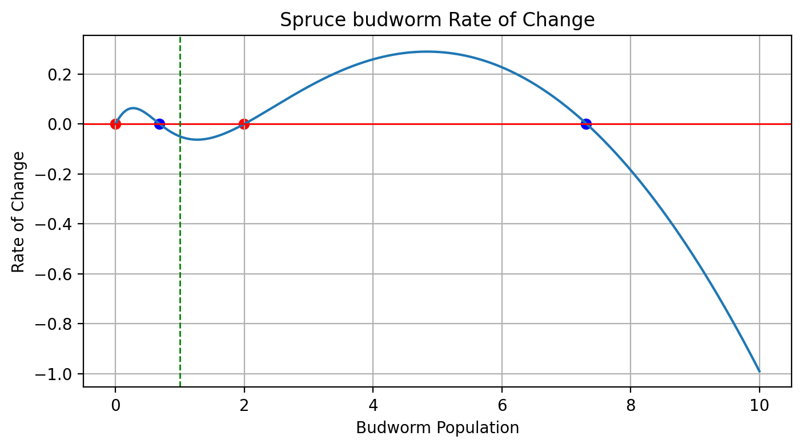

## Build Once, Reuse Everywhere {.section-break}

The first session sets the numerical pattern for the whole lab: define a model, choose initial data, integrate forward, and interpret what the trajectory means.

::: {.grid-3}
::: {.card}
### Mathematical core
<span class="metric">IVP</span>

$$
\dot y = f(t, y), \qquad y(t_0) = y_0
$$
:::

::: {.card}
### Computational habit
Use the same `solve_ivp()` pipeline in epidemic models, chemical kinetics, and population dynamics.
:::

::: {.card}
### Student payoff
You leave this session with a template that you will reuse in later ODE, synchronization, and PDE topics.
:::
:::

## Session Arc

::: {.grid-3}
::: {.card}
### Solver workflow
Write the right-hand side, define `t_span`, choose `y0`, and inspect the output carefully.
:::

::: {.card}
### SIR model
See how even a small coupled system still fits the same initial value problem pipeline.
:::

::: {.card}
### Nonlinear response
Study saturation and threshold effects in Michaelis-Menten style kinetics and the spruce budworm model.
:::
:::

## The Reusable Pipeline

::: {.workflow-grid}
::: {.tool-card}
### Step 1
Write a function `fun(t, y)` that returns the rate law.
:::

::: {.tool-card}
### Step 2
Choose parameters, a time interval, and an initial state.
:::

::: {.tool-card}
### Step 3
Integrate with `solve_ivp()` and sample the solution on a useful time grid.
:::

::: {.tool-card}
### Step 4
Plot the trajectory and ask which parameters or initial conditions changed the outcome.
:::
:::

$$
\dot y = f(t, y), \qquad y(t_0) = y_0
$$

## What We Need in Python

::: {.grid-3}
::: {.card}
### `scipy.integrate.solve_ivp`
The main numerical integrator for initial value problems in the course.
:::

::: {.card}
### `numpy`
For initial conditions, parameter arrays, time grids, and vectorized post-processing.
:::

::: {.card}
### `matplotlib.pyplot`
For time series, parameter comparisons, and phase-line style interpretation.
:::
:::

## Three Models, One Solver Pattern

::: {.grid-3}
::: {.formula-card}
### SIR epidemic model
$$
\dot S = -\beta S I, \quad
\dot I = \beta S I - \gamma I, \quad
\dot R = \gamma I
$$

Track growth, peak prevalence, and the role of $R_0 = \beta / \gamma$.
:::

::: {.formula-card}
### Saturating rate law
$$
v(S) = \frac{V_{\max} S}{K_m + S}
$$

Use this to discuss why many rates stop growing linearly at large substrate levels.
:::

::: {.formula-card}
### Spruce budworm
$$
\dot x = r x \left(1 - \frac{x}{k}\right) - \frac{x^2}{1 + x^2}
$$

This is the cleanest example of threshold behavior and bistability in the session.
:::
:::

## Bistability Is a Modeling Signal

::: {.columns}
::: {.column width="58%"}
### Spruce budworm takeaways

- The balance between logistic growth and saturating predation creates multiple equilibria.
- Small perturbations can push the system toward a low-population or high-population regime.
- The same ODE solver works, but the interpretation now matters as much as the integration.

<span class="small-text">Use the full module page when you want the phase-line analysis and parameter exploration.</span>
:::

::: {.column width="42%"}
{.figure-frame}
:::
:::

## Minimal Code Pattern

```python
import numpy as np
from scipy.integrate import solve_ivp


def rhs(t, y, rate):
    return -rate * y


t_eval = np.linspace(0.0, 10.0, 200)
sol = solve_ivp(rhs, (0.0, 10.0), y0=[2.0], t_eval=t_eval, args=(0.5,))
```

Keep this pattern in mind. Most later solver-based sessions are variations on this same structure.

## Full Module Pages {.inverse}

Use the deck for the lecture flow, then move to the module pages for derivations, code walkthroughs, and exercises.

::: {.module-links}
[Session overview](../modules/ode-1d/index.qmd)
[SIR epidemic model](../modules/ode-1d/sir.qmd)
[Michaelis-Menten kinetics](../modules/ode-1d/michaelis-menten.qmd)
[Spruce budworm](../modules/ode-1d/spruce-budworm.qmd)
[Assignment](../modules/ode-1d/assignment.qmd)
:::
