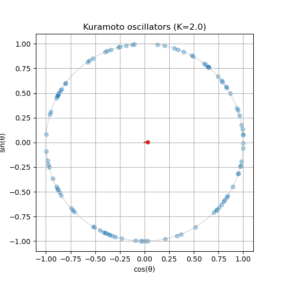

## When Many Oscillators Talk {.section-break}

The main question in this session is no longer what one trajectory does, but when a whole population of oscillators starts moving coherently.

## Ingredients of the Kuramoto Model

::: {.grid-3}
::: {.card}
### State
Each oscillator carries a phase $\theta_i(t)$ on the unit circle.
:::

::: {.card}
### Heterogeneity
Each oscillator has a natural frequency $\omega_i$ drawn from a distribution.
:::

::: {.card}
### Coupling
All-to-all sinusoidal interaction tries to align phases when $K > 0$.
:::
:::

$$
\dot \theta_i = \omega_i + \sum_{j=1}^N \frac{K}{N} \sin(\theta_j - \theta_i)
$$

## The Macroscopic Observable

$$
r e^{i \Psi} = \frac{1}{N} \sum_{j=1}^N e^{i \theta_j}
$$

::: {.grid-2}
::: {.formula-card}
### Order parameter $r$
$r \approx 0$ means incoherence. $r \approx 1$ means strong phase alignment.
:::

::: {.formula-card}
### Mean phase $\Psi$
The average direction tells you where the synchronized pack is located on the circle.
:::
:::

## Mean-Field Interpretation

$$
\dot \theta_i = \omega_i + K r \sin(\Psi - \theta_i)
$$

::: {.grid-2}
::: {.card}
### Positive feedback
If a small amount of coherence appears, the effective coupling $K r$ grows and recruits more oscillators.
:::

::: {.card}
### Critical onset
Synchronization appears when the coupling becomes strong enough relative to the spread of natural frequencies.
:::
:::

## From Theory to Bifurcation Diagram

::: {.grid-2}
::: {.formula-card}
### What we plot
Draw the long-time average of $r$ against the coupling strength $K$.
:::

::: {.formula-card}
### Common mistake
Do not compare empirical data from one frequency distribution against the exact theory for another. The deck now makes that warning explicit instead of hiding it in a later slide.
:::
:::

## What the Full Simulation Shows

::: {.columns}
::: {.column width="52%"}
### Visual cues to look for

- points clustering on the unit circle,
- growth of the order parameter,
- sensitivity to $K$, $N$, and the frequency distribution,
- mismatch between finite-$N$ simulations and asymptotic theory.

### Python stack

- `solve_ivp()` for time integration,
- `matplotlib.animation` for the circle dynamics,
- `matplotlib.widgets.Slider` for parameter control.
:::

::: {.column width="48%"}
{.figure-frame}
:::
:::

## The Assignment Shift

The assignment extends the same synchronization ideas to a more applied system, the Millennium Bridge style crowd-bridge problem. The mathematical structure stays familiar: coupled oscillators, collective response, and parameter-dependent onset.

## Full Module Pages {.inverse}

::: {.module-links}
[Session overview](../modules/ode-coupled/index.qmd)
[Kuramoto theory](../modules/ode-coupled/kuramoto.qmd)
[Oscillators and animation](../modules/ode-coupled/kuramoto-oscillators.qmd)
[Bifurcation diagram](../modules/ode-coupled/kuramoto-diagram.qmd)
[Full simulation](../modules/ode-coupled/kuramoto-full.qmd)
[Assignment](../modules/ode-coupled/assignment.qmd)
:::
