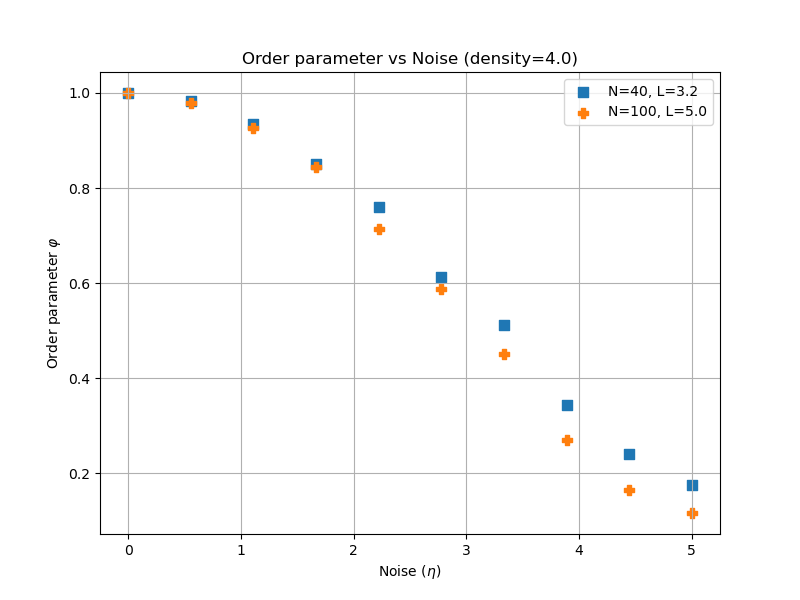
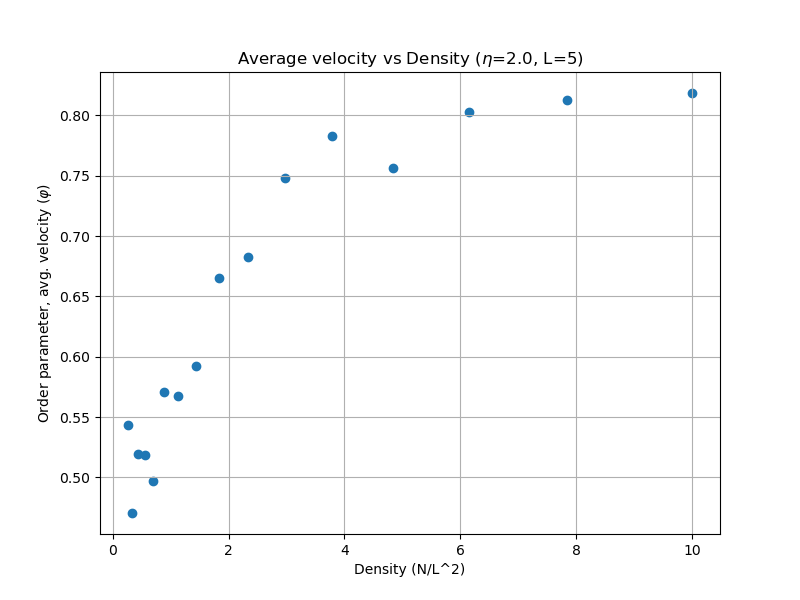

## Local Rules, Global Order {.section-break}

Collective motion is the first session where the main model is not a continuous-time ODE. The dynamics come from a repeated update rule applied to many agents at once.

## Session Arc

::: {.grid-3}
::: {.card}
### Base rule
Start with Vicsek alignment, noise, constant speed, and periodic boundaries.
:::

::: {.card}
### Observable
Measure the transition with the order parameter instead of relying on animation alone.
:::

::: {.card}
### Extensions
Then ask what changes when you add repulsion, predators, or richer decision rules.
:::
:::

## Why This Is Not an ODE Session

::: {.grid-2}
::: {.card}
### Previous sessions
State changes came from derivatives and continuous-time rate laws.
:::

::: {.card}
### This session
Each time step updates headings and positions directly from neighbor information, so a simulation loop is more natural than `solve_ivp()`.
:::
:::

## Vicsek Update Rule

$$
\theta_i(t + \Delta t) = \langle \theta_j(t) \rangle_{j \in \mathcal N_i} + \frac{\eta}{2} \xi_i
$$

$$
\mathbf x_i(t + \Delta t) = \mathbf x_i(t) + v_0 \Delta t (\cos \theta_i, \sin \theta_i)
$$

::: {.card}
At each step, every boid aligns with neighbors inside a radius $r$, adds noise, moves at constant speed, and wraps back into the box with periodic boundary conditions.
:::

## What Moves the Transition

::: {.grid-2}
::: {.data-card}
### Noise $\eta$
Higher noise breaks alignment and pushes the system toward disorder.
:::

::: {.data-card}
### Density
More local contacts make alignment easier.
:::

::: {.data-card}
### Interaction radius $r$
This sets who can influence whom at each step.
:::

::: {.data-card}
### Speed $v_0$
This controls how quickly local alignment propagates through the box.
:::
:::

## The Order Parameter Is the Summary Statistic

::: {.columns}
::: {.column width="50%"}
{.figure-frame}
:::

::: {.column width="50%"}
{.figure-frame}
:::
:::

::: {.card}
Use the average normalized velocity to quantify how ordered the flock is. The interesting part is the transition, not just the animation.
:::

## The Session Extends in Two Directions

::: {.grid-2}
::: {.formula-card}
### Couzin model
Add a repulsion zone so agents avoid collisions instead of only aligning.
:::

::: {.formula-card}
### Predator extension
Add an escape rule, then decide whether the predator is passive, autonomous, or includes eating-spawning dynamics.
:::
:::

## Minimal Simulation Loop

```python
for step in range(num_steps):
    theta = update_angles(xy, theta, radius=r, noise=eta)
    xy = xy + speed * dt * np.vstack((np.cos(theta), np.sin(theta)))
    xy = xy % box_size
    order[step] = compute_order_parameter(theta)
```

This is the discrete-time analogue of the solver loop from the ODE sessions.

## Full Module Pages {.inverse}

::: {.module-links}
[Session overview](../modules/collective-motion/index.qmd)
[Vicsek model](../modules/collective-motion/vicsek.qmd)
[Vicsek animation](../modules/collective-motion/vicsek-animation.qmd)
[Vicsek validation](../modules/collective-motion/vicsek-validation.qmd)
[Couzin model](../modules/collective-motion/couzin.qmd)
[Predator extension](../modules/collective-motion/vicsek-predator.qmd)
[Assignment](../modules/collective-motion/assignment.qmd)
:::
